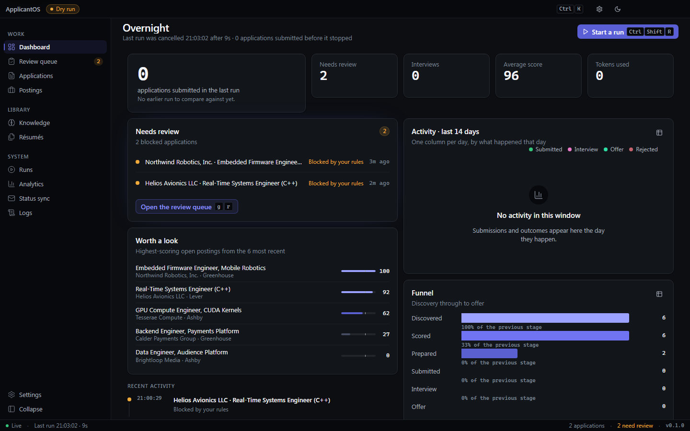
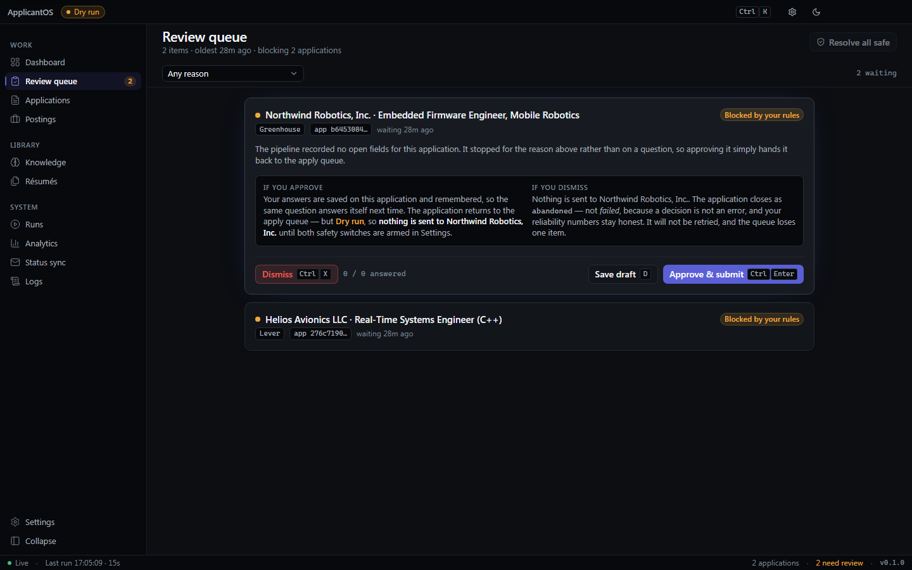
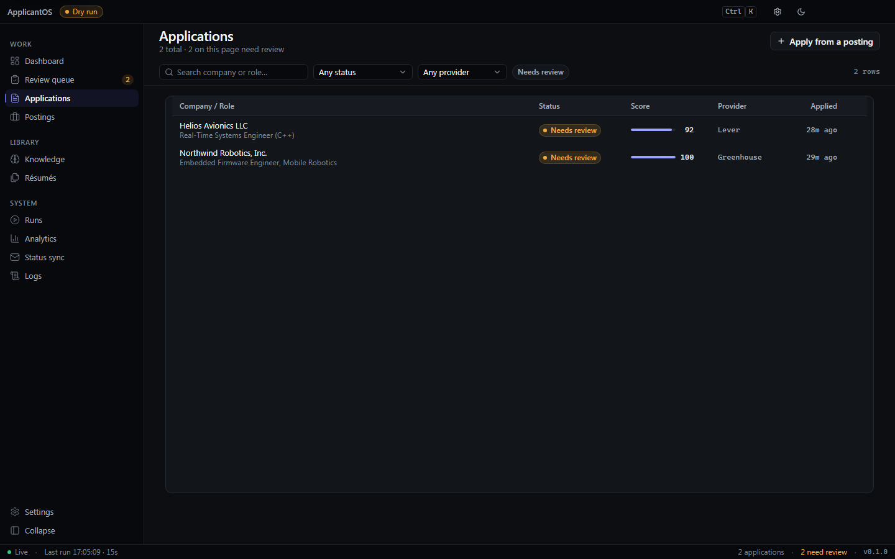
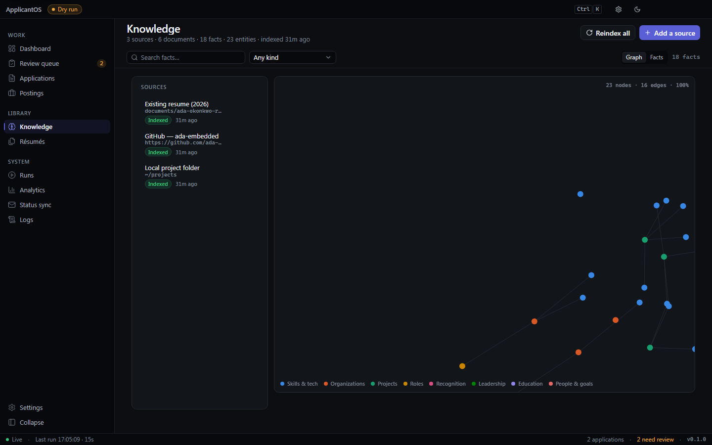
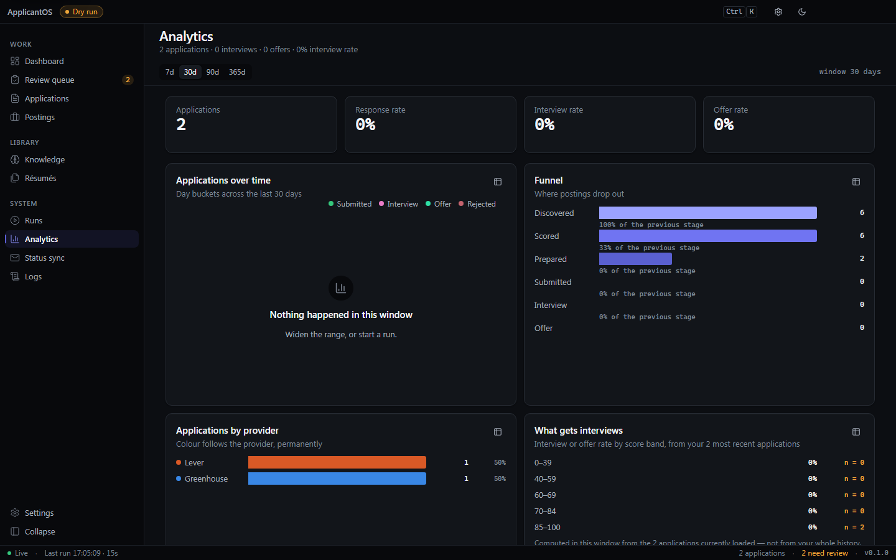

# ApplicantOS

Applying to jobs is mostly copying the same information into slightly different forms. This does
that part for you.

It watches job boards for roles you'd actually want, scores them against what you care about,
writes a resume tailored to each one, fills out the application, and keeps a record of every
submission with a screenshot proving it went through. When it hits something it isn't sure about —
an essay question, a captcha, a field it can't answer honestly — it stops and asks you instead of
guessing.

The part I think is actually interesting is underneath: it doesn't store your resume. It stores
what you've *done*.

---

## The idea

Most resume tools keep a master document and edit it. That falls apart the moment you have more
than one kind of job you're applying for, because a resume for an embedded firmware role and a
resume for a graphics role aren't edits of each other — they're different documents built from the
same life.

So ApplicantOS keeps a **knowledge graph** instead. It reads your GitHub, your portfolio site,
your project folders, your old resumes, your LinkedIn export, and breaks all of it into individual
facts:

```
"Wrote a FreeRTOS scheduler for an STM32F4, cut task latency 40%"
   skills:       [C, FreeRTOS, STM32, embedded]
   metrics:      ["40%"]
   organization: "Robotics Team"
   dates:        2024-09 → 2025-05
   source:       github.com/you/flight-controller/README.md
   impact:       82
```

A resume is then a **query** against that graph. Microsoft Embedded pulls firmware, RTOS and C++ to
the top. NVIDIA pulls CUDA, computer vision and OpenCV. Roblox pulls Luau, networking and
performance work. Same facts, different views.
([Worked examples for all three.](docs/AI_PIPELINE.md#7-worked-examples))

This has a useful side effect: because every bullet on a generated resume carries the ID of the
fact it came from, the model **can't invent things**. If it returns a bullet that doesn't trace
back to something you actually did, that bullet gets dropped before it's ever rendered. It's not a
prompt asking it nicely not to lie — it's a validation step it can't route around.

And when you push a commit or add a class project, the next resume already knows about it.

---

## Status

Every planned phase has landed. Honest state, checked against the tree:

| | |
|---|---|
| Foundation — config, database, 24-table schema, migrations, cache, plugin system | ✅ |
| Knowledge engine — 6 analyzers, indexer, hybrid retrieval, entity graph, AI memory | ✅ |
| Job discovery — 5 ATS providers, deduplication | ✅ |
| Scoring — deterministic rule engine + optional LLM adjustment | ✅ |
| Document generation — LaTeX / DOCX / HTML / Markdown, one-page enforcement | ✅ |
| Resume tailoring engine + cover letters | ✅ |
| Browser automation + submission | ✅ built, 🟡 not yet proven against a live ATS form |
| REST API + WebSocket events + background workers | ✅ |
| Automatic status sync (reads your email for rejections/interviews) | ✅ built, 🟡 OAuth flows untested end-to-end |
| Desktop app (Tauri v2 + React 19) | ✅ |
| Prompt-injection defence for job-description text | ⬜ **specified, not built** |
| Signed installers for macOS and Linux | ⬜ Windows sidecar only |

**~147,000 lines across 314 source files** — 170 Python modules, 113 TypeScript/React files, 7 Rust
modules, 19 test modules. `pytest` runs **475 tests in 64 seconds** with no API keys and no
Postgres.

Two quality gates are amber and worth naming rather than hiding: `ruff check .` reports 31
cosmetic findings, and `mypy app` reports 66 errors across 33 of 170 files. Neither affects
runtime. The desktop app's `typecheck` and `lint` are clean.

The two ⬜ rows matter. [`docs/ROADMAP.md`](docs/ROADMAP.md) says exactly what is missing and what
it would take.

---

## Quickstart

### One command

```bash
git clone https://github.com/Blasted-ctrl/ApplicantOS.git
cd ApplicantOS

./scripts/bootstrap.sh          # macOS / Linux
.\scripts\bootstrap.ps1         # Windows
```

That installs, migrates and seeds a working backend with **no API keys, no Postgres, no Redis and
no Docker**. It never flips a safety switch — `AUTO_APPLY_ENABLED` and `DRY_RUN` keep the values
`.env.example` ships, which are the safe ones.

### The desktop app

```bash
cd desktop
npm install
npm run app                     # Tauri shell + React renderer + Python sidecar
```

The Rust shell picks a free port, launches the backend on `127.0.0.1`, waits for `/health`, and
only then shows the window — so there's no white flash and no cold-start skeleton screen.

Renderer only, against a backend you're already running:

```bash
cd desktop && npm run dev
```

### By hand

```bash
python -m venv .venv && .venv/Scripts/activate     # or source .venv/bin/activate
pip install -e ".[dev]"
cp .env.example .env

export SQLITE_MODE=true LLM_PROVIDER=null EMBEDDING_PROVIDER=hashing VECTOR_STORE=memory
alembic upgrade head
python -m scripts.seed

uvicorn app.main:app --reload
```

With Postgres, Redis and background workers:

```bash
docker compose up -d postgres redis
alembic upgrade head

uvicorn app.main:app --reload
celery -A app.workers.celery_app worker -Q discovery,ai,apply,knowledge,maintenance
celery -A app.workers.celery_app beat
```

Add real API keys to `.env` and it uses Claude or GPT instead of the offline stub. Nothing else
changes.

### Point it at your own code

```python
from app.knowledge import KnowledgeIndexer, KnowledgeRetriever
from app.knowledge.analyzers import SourceRef
from app.models.enums import SourceKind

src = await indexer.add_source(
    user.id, SourceRef(kind=SourceKind.PROJECT_FOLDER, uri="~/code/my-project")
)
print(await indexer.index_source(src.id))
print(await retriever.retrieve(user.id, "embedded systems firmware C++"))
```

---

## Screenshots

Captured from the running app at 1440×900, against the database `python -m scripts.seed` produces
plus two real runs over it — one that finished and one that was stopped part-way. Every number on
screen was computed by the code that ships — the scores by `Scorer`, the two blocked applications
by `Pipeline.run_one` stopping at the kill switch, the run counters by the same
`SessionService.record` calls the Celery workers make. Nothing is mocked and nothing is drawn.

### Dashboard

The morning read: what the last run did, what needs a human, what is worth a look next. The run
finished, submitted nothing — submission is off — and put two applications in front of a human,
which is what the subtitle says.


### Dashboard, after a run that did not finish

The same screen a few minutes later, after the next run was stopped part-way through. A run that
was cancelled or failed is reported as exactly that, and it takes over the subtitle when it is the
most recent thing that happened — being told the run died is the point, and folding it into "last
run finished · 0 applications" would be indistinguishable from an ordinary quiet night. Both runs
are in the history on [the runs screen](docs/screenshots/sessions.png).



### Review queue

Two applications the agent refused to send. Both stopped at the kill switch — `Dry run` is on, so
the card says plainly that approving still sends nothing until both switches are armed.



### Applications

Every application, its status, its score and where it came from.



### Knowledge

Three indexed sources on the left, and the entity graph they produced — 23 nodes, 16 edges. This
is the graph résumés are generated from; there is no stored résumé to edit.



### Analytics

The funnel with real counts: six postings discovered and scored, two prepared, none submitted —
because submission is off.



The remaining screens — postings, application detail, résumés, runs, status sync, logs, settings
and onboarding — are in [`docs/screenshots/`](docs/screenshots/).

The design system they're built against is [`docs/UI.md`](docs/UI.md), including a testable
performance budget: route changes in one frame, cold start to real data in 800ms, 60fps on a
5,000-row table. Measured on the production build against a live backend: cold start to the
dashboard's first real figure **455ms** from an empty cache and **262ms** with the hot snapshot,
route change to an already-visited route **8.6ms p50** once the harness's own two-frame overhead
is subtracted, and click-to-repaint on a filter chip **13ms p50 / 18ms p99**.

---

## Which job boards work

| | Finds jobs | Applies for you | |
|---|---|---|---|
| **Greenhouse** | ✅ | ✅ | Public board API, public application form |
| **Lever** | ✅ | ✅ | Same |
| **Ashby** | ✅ | ✅ | Same |
| **Workday** | ✅ | ❌ | Account-gated multi-step flow, different per tenant. Sent to manual review. |
| **LinkedIn** | ⚠️ limited | ❌ | See below |

**About LinkedIn.** Its terms prohibit automated scraping and automated applications, so this
doesn't do either. It won't log in, won't scrape, and won't submit. What it *will* do is read a
LinkedIn data export you download yourself, or a public RSS feed, and surface those roles for you
to apply to manually. That's a deliberate limitation, not a missing feature — and if it ever looks
like a bug worth "fixing", it isn't.

Adding a new ATS is a single file plus an entry point. Nothing in the core changes — there's a
[complete worked tutorial](docs/ADDING_A_PROVIDER.md) that builds one end to end.

---

## It won't apply to anything until you tell it to

Two independent switches, both off by default:

```bash
AUTO_APPLY_ENABLED=false      # master kill switch
DRY_RUN=true                  # fills forms, never clicks submit
```

Submission requires `AUTO_APPLY_ENABLED=true` **and** `DRY_RUN=false`. A fresh install fills out
applications and stops at the button, so you can watch it work before trusting it.

Beyond that:

- **It escalates instead of guessing.** Low confidence on an answer, more essay questions than
  your limit, a captcha, an MFA prompt, a required field it can't answer — all of it goes to a
  review queue rather than getting a made-up answer with your name on it.
- **It won't apply twice.** Enforced by a database constraint *and* a status check, because one of
  those alone will eventually fail you.
- **Demographic questions are never inferred.** Gender, race, disability and veteran status come
  from what you entered or default to "decline to self-identify". The model never sees them.
- **Every submission is photographed.** Before and after. If a company later says they never got
  it, you have the screenshot and the timestamp.
- **Your data stays local by default.** Local filesystem storage, local vector store, optional
  local LLM. Mailbox credentials live in your OS keychain and never touch the database.

Nine of the ten golden rules have a dedicated test file named after the rule they defend
(`tests/test_golden_*.py`). A rule with no test is a comment.

---

## Layout

```
app/
  knowledge/     the knowledge graph — analyzers, extraction, vector search, retrieval
  jobs/          ATS providers + deduplication
  ai/            model plugins, embeddings, scoring, resume engine, cover letters
  documents/     resume rendering — LaTeX, DOCX, HTML, Markdown
  browser/       Playwright automation
  tracking/      reads your email to learn application outcomes
  services/      orchestration — the pipeline and its guard ladder
  api/           FastAPI + WebSocket events
  workers/       Celery tasks across five queues
desktop/         Tauri v2 shell + React 19 app
docs/            architecture, contracts, design system, runbook
```

Providers, AI models, resume templates, parsers, knowledge analyzers and status trackers are all
plugins behind one registry. Nothing imports a concrete implementation directly, which is what
keeps adding a job board from touching the pipeline.

---

## Docs

| | |
|---|---|
| [`docs/ARCHITECTURE.md`](docs/ARCHITECTURE.md) | The layers, the request and task lifecycles, the ERD, and why the plugin and DTO boundaries exist |
| [`docs/PIPELINE.md`](docs/PIPELINE.md) | Every stage from scheduler to cleanup — inputs, outputs, failure modes, how it resumes |
| [`docs/AI_PIPELINE.md`](docs/AI_PIPELINE.md) | The knowledge graph, the four hallucination guards, the one-page budget, worked examples |
| [`docs/SCORING.md`](docs/SCORING.md) | Rule format, the default pack, preference gates, the +40/+30/+25/… = 70 example |
| [`docs/ADDING_A_PROVIDER.md`](docs/ADDING_A_PROVIDER.md) | A complete tutorial building a new ATS integration |
| [`docs/CONFIGURATION.md`](docs/CONFIGURATION.md) | All 87 settings — what each does and when to change it |
| [`docs/RUNBOOK.md`](docs/RUNBOOK.md) | Healthchecks, metrics, draining workers, replaying a failure, backup/restore |
| [`docs/ROADMAP.md`](docs/ROADMAP.md) | Honest status of the twelve completeness items, then what's next |
| [`docs/GETTING_STARTED.md`](docs/GETTING_STARTED.md) | **Start here** — using it on your own job hunt, in about 20 minutes |
| [`docs/CONTRACTS.md`](docs/CONTRACTS.md) | Every module boundary — the spec the whole thing is built against |
| [`docs/UI.md`](docs/UI.md) | Design system for the desktop app, including the performance budget |
| [`docs/SAFETY.md`](docs/SAFETY.md) | The safety envelope, in one place |
| [`docs/PACKAGING.md`](docs/PACKAGING.md) | Freezing the sidecar, bundling, signing, shipping |
| [`docs/WORKING_AGREEMENT.md`](docs/WORKING_AGREEMENT.md) | How the build is run |
| [`CLAUDE.md`](CLAUDE.md) | Orientation for anyone (or anything) writing code here |

---

## A caveat worth reading

Automating job applications sits in a grey area. Some companies are fine with it; some consider it
a terms violation; a few will reject you for it if they notice. This tool tries to stay on the
right side of that line — it won't touch platforms that prohibit automation, it applies at human
speed rather than blasting hundreds of applications an hour, and it defaults to doing nothing.

But you're the one applying. Read the terms of the places you're applying to, keep the review queue
honest, and skim what it generates before it goes out with your name attached.

---

## License

MIT. See [LICENSE](LICENSE).
