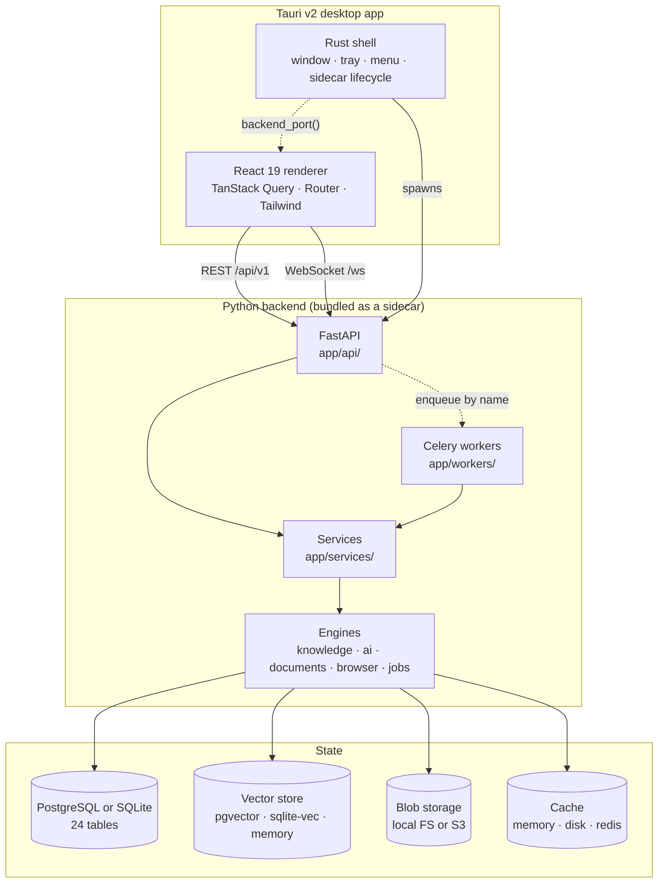
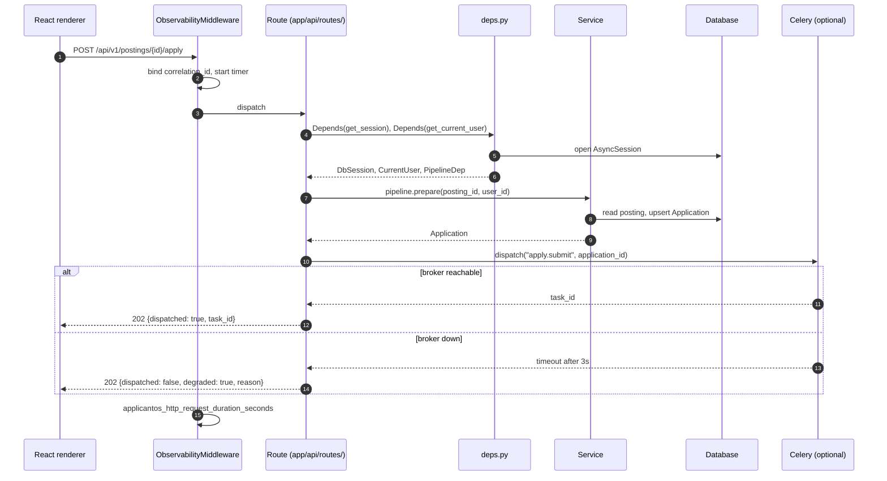
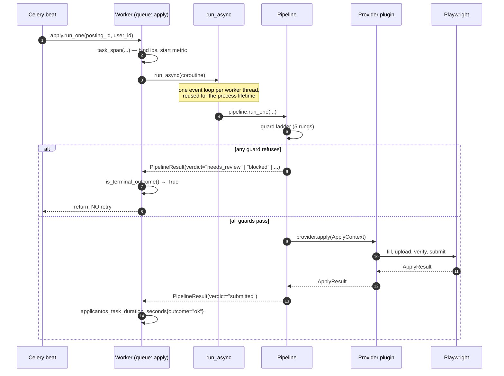
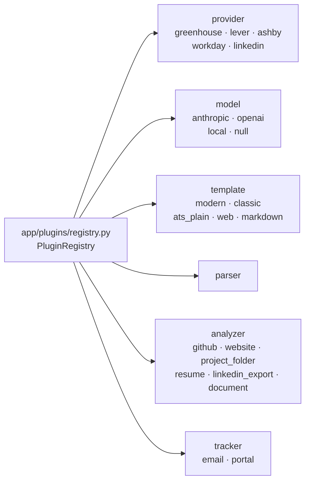
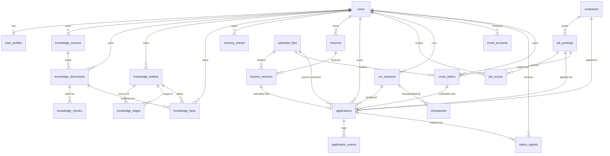

# Architecture

How ApplicantOS is put together, and why it is put together that way.

This document is a walkthrough for someone who has just cloned the repository. It assumes you have
read [`README.md`](../README.md) and nothing else. The binding specification is
[`docs/CONTRACTS.md`](CONTRACTS.md) — when this document and that one disagree, that one wins.

---

## 1. The shape of the thing

ApplicantOS is a **local-first desktop application** with a conventional server inside it.



Three properties fall out of that diagram and explain most of the decisions below:

**The backend is a sidecar, not a service.** It is spawned by the Rust shell on a random free
port bound to `127.0.0.1`, and it dies with the app. There is no login, no multi-tenancy, and no
network exposure. `X-User-Id` identifies the user because there is exactly one.

**The API and the workers are separately deployable.** The web process never imports
`app.workers`; it enqueues by string name (§6). A desktop install with no Redis runs the API and
performs work synchronously through the same service objects.

**Every heavy dependency is optional.** Playwright, PostgreSQL, Redis, LaTeX, the Anthropic and
OpenAI SDKs — all lazily imported inside the function that uses them. `import app.main` works on a
machine with none of them installed, which is what makes the zero-dependency mode real rather than
aspirational.

---

## 2. The layers, bottom to top

| Layer | Path | Depends on | Knows nothing about |
|---|---|---|---|
| Configuration | `app/config/` | pydantic-settings | everything else |
| Database core | `app/database/` | config | models |
| Models | `app/models/` | database core | schemas, services |
| Schemas | `app/schemas/` | models (enums only) | ORM sessions |
| Cache | `app/cache/` | config | domain |
| Plugins | `app/plugins/` | config, enums | concrete plugins |
| Engines | `app/knowledge/`, `app/jobs/`, `app/ai/`, `app/documents/`, `app/browser/`, `app/storage/`, `app/tracking/` | plugins, cache, models | each other |
| Services | `app/services/` | engines, models | HTTP, Celery |
| API | `app/api/`, `app/main.py` | services, schemas | workers |
| Workers | `app/workers/` | services | HTTP |
| Desktop | `desktop/` | the HTTP API | Python |

The dependency arrows all point downward and there are no cycles. Two rules keep it that way, and
both are enforced by tests:

- **`app/ai/scoring.py` never imports the ORM.** It reads postings duck-typed, so the rule engine
  stays importable, pure and testable without SQLAlchemy. `normalize_company_name` is duplicated
  from `app/models/company.py` rather than imported, deliberately.
- **`app/jobs/*` never touches the ORM.** Providers take and return DB-free DTOs (§5).

### `app/config/`
`settings.py` holds all 87 settings (see [`CONFIGURATION.md`](CONFIGURATION.md)); `logging.py`
installs the structlog chain including `redact_secrets`, which is golden rule 4;
`scoring_rules.yaml` is the default scoring pack.

### `app/database/`
An async engine, `session_scope()` for workers, `get_session()` for FastAPI, and — importantly —
`types.py`, which defines `GUID`, `JSONType`, `EmbeddingType` and `UTCDateTime`. Those exist so
the *same* model definitions run on PostgreSQL with pgvector and on SQLite with a JSON list. A raw
`postgresql.JSONB` import in a model breaks the lightweight install.

### `app/models/`
24 SQLAlchemy 2.0 tables and every shared enum. Enums are stored as strings, never as native
PostgreSQL enum types, for the same portability reason.

### `app/cache/`
One `Cache` protocol, four implementations (`memory`, `disk`, `redis`, and a `TieredCache`
read-through), plus `make_key`/`hash_payload` for content-addressed keys. Never `hash()` — it is
salted per process, so a cached key would not survive a restart.

### `app/plugins/`
One registry for all five plugin kinds. See §4.

### `app/knowledge/`
The knowledge engine — six analyzers, an extractor, three vector-store backends, the entity graph,
the fact store, hybrid retrieval, and the AI memory. See [`AI_PIPELINE.md`](AI_PIPELINE.md).

### `app/jobs/`
Five ATS providers plus deduplication. See [`ADDING_A_PROVIDER.md`](ADDING_A_PROVIDER.md).

### `app/ai/`
Model plugins (Anthropic / OpenAI / local / null), embeddings, the scoring engine, the resume
engine, the cover-letter writer, field answering, and `untrusted.py` — the prompt-injection
chokepoint every externally-sourced string passes through.

### `app/documents/`
A render model (`ResumeDocument`), five templates behind a `TemplatePlugin` interface, and
`render_resume`, which owns the one-page shrink loop.

### `app/browser/`
Playwright session management, field discovery, autofill, blocker detection, submission
verification and artifact capture. The only code that acts irreversibly.

### `app/services/`
Where the modules meet, and therefore the only place product *policy* lives. `Pipeline` is the
centre of gravity.

### `app/api/` and `app/workers/`
Two thin front-ends onto the same services: one synchronous over HTTP, one asynchronous over a
queue. Neither contains business logic, which is what makes "run it from the UI" and "run it on a
schedule" mean the same thing.

---

## 3. The request lifecycle



Two details in that diagram are load-bearing.

**A missing broker is a 202, not a 500.** A 500 tells the user their request failed, when in fact
the request was fine and the system is partly down. `Dispatch.degraded` lets the desktop app say
"queued work could not be started — the background worker is not running", which is both true and
actionable. It also keeps a read-only install from looking broken.

**The route decided nothing.** It resolved a service and called one method. That is what makes the
worker path (§4 below) equivalent rather than merely similar.

### Errors

`app/api/errors.py` maps typed exceptions onto stable string codes — `not_found`, `conflict`,
`provider_auth_required`, `rate_limited`, `unsupported_flow`, `document_render_failed`,
`plugin_not_found`, … — so the desktop app branches on a code, never on a message. A route never
constructs an error body.

### Events

`app/api/events.py` publishes 18 typed events over `/ws`. Their payloads are **the same pydantic
schemas the REST endpoints return**, which is why the renderer can call
`queryClient.setQueryData` directly instead of refetching — the difference between a live update
that repaints one cell and one that flashes a loading state.

---

## 4. The task lifecycle



**`run_async` keeps one event loop per worker thread.** `asyncio.run` would create and destroy a
loop per task; SQLAlchemy's async engine caches connections bound to the loop that opened them, so
a per-task loop hands the next task a pool of connections belonging to a loop that no longer
exists. This is the kind of bug that manifests as intermittent `Event loop is closed` under load
and nowhere else.

**A terminal verdict is checked explicitly, not inferred.** `needs_review`, `blocked`,
`already_applied` and `skipped` are answers, not failures. `is_terminal_outcome(result)` is
consulted before any retry, rather than relying on the fact that a terminal verdict happens not to
raise — because a later refactor that starts raising would silently turn every escalation into
three browser runs against a form a human is already looking at.

Five queues (`discovery`, `ai`, `apply`, `knowledge`, `maintenance`) exist because their resource
profiles differ: providers rate-limit, models cost tokens, browsers cost memory and 45 minutes.
Routing lives in one frozen mapping, `TASK_QUEUES` in `app/api/tasks.py`, from which
`app/workers/celery_app.py` derives its `task_routes` — so the API and the workers cannot disagree
about where a task goes.

---

## 5. Why there is a DTO layer

`app/jobs/base.py` defines `JobPostingDTO` and `UserProfileDTO`: frozen dataclasses with
`from_model()` constructors, carrying no ORM state at all. Providers and the browser layer take and
return these, never `JobPosting` or `UserProfile`.

This costs a conversion. It buys four things:

1. **A provider cannot lazy-load.** Handing a detached SQLAlchemy row to code that runs inside a
   Playwright callback is how you get `MissingGreenlet` in production and nowhere else. A frozen
   dataclass cannot emit a query.
2. **A provider cannot mutate.** Discovery must not be able to write to the database as a side
   effect of parsing a feed.
3. **A provider is testable without a database.** `tests/test_providers.py` constructs DTOs
   directly; there is no fixture, no session, no migration.
4. **The boundary is auditable.** "Does this provider touch the ORM?" is answerable by grep,
   which matters because providers are the extension point strangers will write.

The same reasoning applies to `ScoreRule`/`ScoreResult` in scoring and to `ExtractedFact`/
`ExtractedEntity` in the knowledge analyzers: the plugin author works with plain data, and the
core owns persistence.

---

## 6. Why everything is a plugin

One registry, six kinds:



**Nothing outside a plugin's own package may import a concrete implementation.** Not
`from app.jobs.greenhouse import GreenhouseProvider`, not `from app.ai.models.anthropic import
AnthropicModel`. Consumers call `registry.get(kind, name)`, `get_provider(name)`,
`provider_for_url(url)`, `get_llm(tier)`, `get_template(name)`.

The rule exists because of what a violation costs, not because indirection is elegant:

- **It keeps optional dependencies optional.** A direct import of `app.ai.models.anthropic` at
  module scope makes the `anthropic` SDK a hard dependency of whatever imported it. Through the
  registry, an uninstalled SDK is a plugin that fails its healthcheck.
- **It makes "add a provider" a single-file change.** That is the product's headline extension
  point, and it only stays true if the core never names a provider.
- **It makes a third-party plugin a first-class citizen.** `loader.py` imports built-ins and then
  entry points from `applicantos.providers`, `applicantos.models`, `applicantos.templates`,
  `applicantos.analyzers`, `applicantos.trackers`. A pip-installed provider is indistinguishable
  from a built-in one.

Enforced by `tests/test_golden_plugin_isolation.py`, and greppable:

```bash
grep -rn "from app.jobs.\(linkedin\|greenhouse\|lever\|ashby\|workday\)" --include=*.py app/ \
  | grep -v "^app/jobs/"
```

---

## 7. The data model

24 tables. Grouped by what they are for:



`email_accounts` deliberately has no foreign key from `status_signals`: a signal records the
`SignalSource` it came from, not which mailbox row was polled, so disconnecting an account never
orphans the evidence it produced.

`log_entries` and `cache_entries` are standalone by design — `log_entries` carries *correlation
ids*, not foreign keys, so a log line survives the deletion of what it describes.

Six unique constraints do real work:

| Constraint | Table | Guarantees |
|---|---|---|
| `UNIQUE(user_id, posting_id)` | `applications` | **Never apply twice** (golden rule 1) |
| `UNIQUE(provider, external_id)` | `job_postings` | Provider-level identity |
| `UNIQUE(dedupe_key)` | `job_postings` | Cross-provider deduplication |
| `UNIQUE(user_id, kind, normalized_name)` | `knowledge_entities` | Entities merge instead of duplicating |
| `UNIQUE(document_id, ordinal)` | `knowledge_chunks` | Chunk ordering integrity |
| `UNIQUE(user_id, source, external_ref)` | `status_signals` | An email is processed once |

### The two mutual foreign keys

`applications.resume_version_id → resume_versions.id` and
`resume_versions.application_id → applications.id` form a cycle, as do applications and cover
letters. This is deliberate: a resume version needs to know which application it was generated
for, and an application needs to know which version it submitted. The cycle is resolved
per-dialect in the migration (see `docs/OPEN_QUESTIONS.md` §27) and one side is always nullable.

### Why knowledge, not documents

`KnowledgeFact` replaces what most tools call "a master resume bullet". A resume is a **generated
view** — `ResumeVersion.content_json` is retained forever while the rendered PDF is disposable,
and every bullet carries the `KnowledgeFact.id` it came from. That single column is what makes
golden rule 7 mechanical rather than aspirational: a bullet with no traceable source is dropped
before rendering, not asked politely not to appear.

---

## 8. Where state lives

| Kind | Default | Alternatives | Notes |
|---|---|---|---|
| Relational | PostgreSQL 16 | SQLite (`SQLITE_MODE=true`) | Same models; portable column types |
| Vectors | pgvector (ivfflat, cosine) | `sqlite_vec`, pure-python `memory` | The memory store is always available |
| Blobs | local filesystem under `var/storage` | S3 / any S3-compatible endpoint | Resumes, cover letters, screenshots |
| Cache | Redis | disk (content-addressed), memory (LRU+TTL), tiered | SQLite mode forces disk |
| Queue | Redis | none (API runs work inline) | Celery is optional at runtime |
| Secrets | OS keychain (`keyring`) | — | Mailbox tokens **never** reach the database |

**The user's data stays local by default.** Local filesystem storage, local vector store, and an
optional local LLM via an OpenAI-compatible endpoint. Nothing is uploaded anywhere the user did
not configure.

---

## 9. Observability

structlog with a `redact_secrets` processor permanently in the chain, recursing through dicts and
lists and scrubbing `password`, `token`, `api_key`, `secret`, `authorization`, `cookie`, `ssn`,
`dob`. Traceback frame locals are off. Bound context keys: `correlation_id`, `user_id`,
`session_id`, `posting_id`, `application_id`, `provider`, `event`.

Fifteen Prometheus metrics at `/metrics` — see [`RUNBOOK.md`](RUNBOOK.md) for what each one looks
like when it goes wrong.

---

## 10. What is enforced, and how

| Golden rule | Mechanism | Test |
|---|---|---|
| 1. Never apply twice | `UNIQUE(user_id, posting_id)` + status guard in `Pipeline.submit` | `test_golden_never_apply_twice.py` |
| 2. Never guess | `ReviewReason` escalation in `AutoFiller` / `FieldResolver` | `test_golden_never_guess.py` |
| 3. Kill switch | `settings.is_submission_allowed` gates `AutoFiller.submit` | `test_golden_kill_switch.py` |
| 4. No secrets in logs | `redact_secrets` processor | `test_golden_redaction.py` |
| 5. Plugin isolation | registry indirection | `test_golden_plugin_isolation.py` |
| 6. Knowledge is truth | `cleanup_application` never touches `content_json` | `test_golden_cleanup.py` |
| 7. Nothing fabricated | fact-id validation in `ResumeEngine.validate` | `test_golden_no_fabrication.py` |
| 8. Everything resumable | `Checkpoint` rows + `CheckpointService.resume_all` | `test_golden_resumable.py` |
| 9. Cache precisely | content-addressed `make_key` | `test_api.py`, engine tests |
| 10. ToS honesty | `supports_auto_apply=False` → `UnsupportedFlowError` | `test_golden_tos.py` |

Nine of the ten have a dedicated test file whose name says which rule it defends. That is on
purpose: a rule with no test is a comment.

---

## See also

- [`CONTRACTS.md`](CONTRACTS.md) — the binding interface specification
- [`PIPELINE.md`](PIPELINE.md) — every stage in detail
- [`AI_PIPELINE.md`](AI_PIPELINE.md) — the knowledge graph and resume generation
- [`SCORING.md`](SCORING.md) — the scoring engine
- [`CONFIGURATION.md`](CONFIGURATION.md) — all 87 settings
- [`RUNBOOK.md`](RUNBOOK.md) — operating it
- [`UI.md`](UI.md) — the desktop design system
