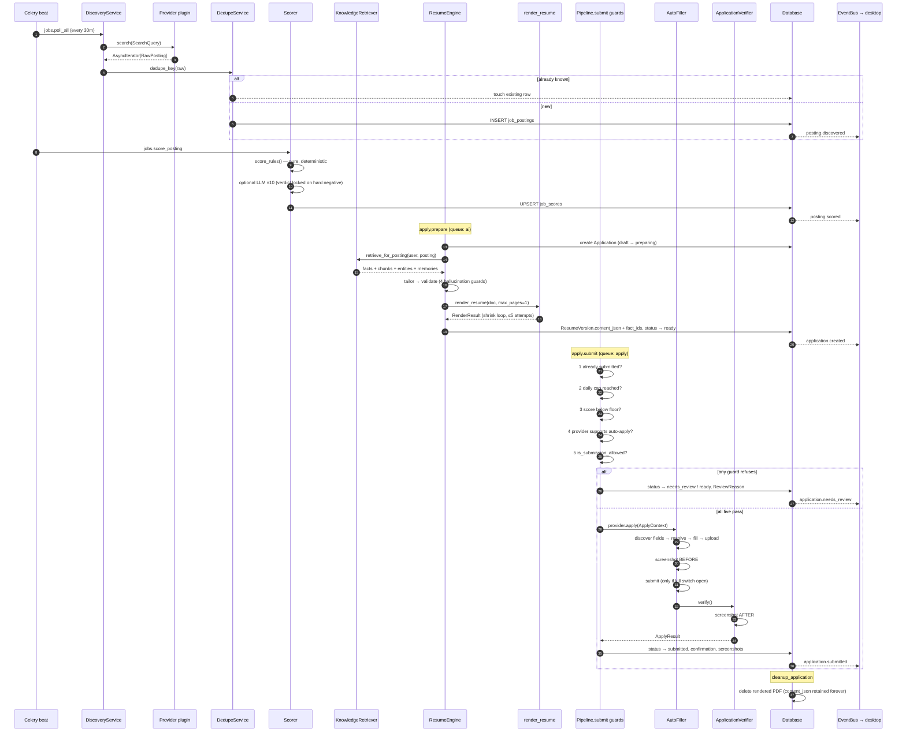
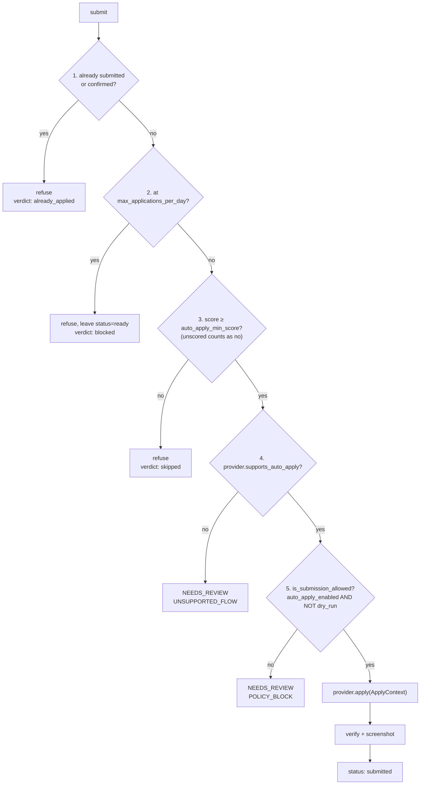

# The Pipeline

Every stage from the scheduler to cleanup: what runs it, what goes in, what comes out, how it
fails, what it writes, and how it resumes after a crash.

The code is `app/services/pipeline.py`. Its module docstring is the short version; this is the
long one.

```
discover → ingest → dedupe → score → prepare (retrieve · tailor · render) → submit (guard · fill · verify) → cleanup
```

---

## The whole thing at once



---

## Stage 1 — Discover

| | |
|---|---|
| **Runs it** | `jobs.poll_all` → `jobs.poll_provider` (queue `discovery`, beat every 30m), or `POST /api/v1/postings/discover` |
| **Code** | `app/services/discovery_service.py`, `app/jobs/*` |
| **Input** | `SearchQuery(keywords, locations, remote_only, posted_within_days, limit, extra)` and the user's `providers_enabled` |
| **Output** | An async stream of `RawPosting` |
| **Writes** | Nothing yet — discovery is read-only until ingest |

Each enabled provider's `search()` is an async generator. It yields lazily, respects
`query.limit`, and sets `raw` to the untouched provider payload so nothing is lost to a parsing
decision made today.

**Failure modes**

| Failure | Handling |
|---|---|
| HTTP 429 | `ProviderRateLimitError(retry_after=…)`; the task retries with backoff |
| HTTP 401/403 | `ProviderAuthError` → `provider_auth_required`; no retry |
| HTTP 404 on one posting | `PostingUnavailableError`; **that posting** is skipped, the search continues |
| Malformed entry in a feed | Logged, skipped, search continues |
| Provider entirely down | The other providers still run — fan-out never aborts on one child |

**One bad posting degrades that posting, never the whole search.** This is why `search()` yields
rather than returning a list: a five-hundred-posting board with one broken entry still produces
four hundred and ninety-nine.

**Resumption.** Discovery is not checkpointed — it is cheap, idempotent, and re-runs every 30
minutes anyway. A crash mid-poll loses at most one cycle. Beat entries carry
`expires=POLL_EXPIRY_SECONDS` (25 min), so a poll that sat in the queue longer than its own
interval is dropped rather than doubling provider traffic for postings the next tick will find.

---

## Stage 2 — Ingest and deduplicate

| | |
|---|---|
| **Runs it** | `Pipeline.ingest(raw)`, called by `DiscoveryService` per posting |
| **Code** | `app/services/dedupe_service.py`, `app/jobs/dedupe.py` |
| **Input** | One `RawPosting` |
| **Output** | `(JobPosting, created: bool)` |
| **Writes** | `job_postings` (upsert), `companies` (upsert on `normalized_name`) |

Three normalisations do the work:

- `canonical_url` — lowercases the host, drops fragments and trailing slashes, strips tracking
  parameters (`utm_*`, `gh_src`, `lever-origin`, `ref`, `trk`, …)
- `dedupe_key` — `sha256(provider|external_id)` when there is an external id, otherwise
  `sha256(norm_company|norm_title|norm_location)`
- `content_hash` — of the description, so an edited posting is detectable

`normalize_company` strips legal suffixes (`Inc`, `Ltd`, `GmbH`, …); `normalize_title` strips
seniority noise and requisition ids.

**The tuning is asymmetric and both directions hurt.** A key that is too loose merges two distinct
jobs and the user never sees a real opening. A key that is too tight lets a duplicate through, and
although `UNIQUE(user_id, posting_id)` stops a literal second application, the user has still
applied twice *in substance* to the same role via two boards. Change `dedupe.py` only with
`tests/test_dedupe.py` in front of you.

**Idempotency.** `ingest` upserts on `dedupe_key`. Running the same feed ten times produces one
row and nine `updated_at` bumps.

---

## Stage 3 — Score

| | |
|---|---|
| **Runs it** | `jobs.score_posting` (queue `ai`), or inline in `Pipeline.run_one` |
| **Code** | `app/ai/scoring.py` |
| **Input** | A `JobPosting` (or DTO, or mapping) plus `UserPreferences` |
| **Output** | `ScoreResult(total, normalized, components, verdict, rationale, model_used)` |
| **Writes** | `job_scores` — `UNIQUE(posting_id, user_id)`, so re-scoring updates in place |

Two halves, kept structurally apart:

1. **`score_rules()` is the score.** Pure, synchronous, deterministic — no clock, no network, no
   database, no randomness. 37 packaged rules plus seven preference gates.
2. **The model only comments.** A bounded `±10` adjustment and one paragraph of prose, cached by
   content hash. **A matched hard negative pins the verdict**, so no amount of model enthusiasm
   talks the pipeline into applying to a blocked company.

Verdicts: `apply` at or above `prefs.min_score`; `review` within 15 points below it; `skip`
otherwise. Full detail in [`SCORING.md`](SCORING.md).

**Failure modes.** Every model failure — missing key, rate limit, timeout, exhausted budget,
unparseable JSON — logs `scoring.llm_unavailable` and returns the rule-based result unchanged.
`Scorer.score()` never raises because of the model.

**Resumption.** Checkpoint step `score` under owner `apply:<application-id>`. Re-scoring is cheap
and deterministic, so a crash here simply re-scores.

---

## Stage 4 — Prepare

`Pipeline.prepare(posting_id, user_id)` — queue `ai`, task `apply.prepare`. This is where the
application row is born and the documents are made. Four sub-stages, each its own checkpoint step.

### 4a. Retrieve

| | |
|---|---|
| **Code** | `app/knowledge/retrieval.py` |
| **Input** | The posting text, the user id |
| **Output** | `RetrievalResult(facts, chunks, entities, memories)` |
| **Writes** | Nothing — retrieval is read-only |

Four signals fused by reciprocal rank fusion: vector similarity over facts, keyword matching over
fact text, vector similarity over document chunks, and one hop of graph expansion. Plus relevant
`MemoryEntry` rows — what the user already corrected.

**Degrades completely.** With no embedder and no vector store the keyword arm answers alone, graph
expansion still works (it is pure SQL), and the pipeline keeps going.

**Failure mode that matters:** an empty graph. A user who has indexed nothing has no facts, and a
resume cannot be generated from nothing. That escalates to `NEEDS_REVIEW` with
`ReviewReason.INSUFFICIENT_KNOWLEDGE` rather than producing an empty document.

### 4b. Tailor

| | |
|---|---|
| **Code** | `app/ai/resume_engine.py` |
| **Input** | `TailorRequest(user, posting, prefs, template, max_bullets, variant_label)` |
| **Output** | `TailorResult(document, selected_fact_ids, reasoning, token_usage, cached)` |
| **Writes** | Nothing yet |

The model **selects and rewrites only**. `validate()` then throws away anything untraceable — a
`fact_id` outside the retrieved set is dropped, a low-overlap rewrite reverts to the fact's own
text, an unsupported number reverts the whole bullet, and organisation/role/dates are copied from
the source fact regardless of what the model returned. See [`AI_PIPELINE.md`](AI_PIPELINE.md).

**Failure mode:** *any* model failure degrades to `fallback_tailor` — a deterministic, LLM-free
ranking that groups facts by organisation and prints their original text verbatim. A resume made
of the user's own sentences in impact order is a perfectly good resume. An outage is not a reason
to skip a posting.

### 4c. Cover letter

`CoverLetterWriter.should_write(posting, prefs)` decides, per `cover_letter_policy`
(`always` / `when_required` / `when_high_score` / `never`). The prose body is a prompt-injection
surface, so the posting text passes through `sanitize_external_text` first.

### 4d. Render

| | |
|---|---|
| **Code** | `app/documents/renderer.py` |
| **Input** | `ResumeDocument`, an output path, a template name, `max_pages` |
| **Output** | `RenderResult(path, page_count, engine, template, bytes_written)` |
| **Writes** | A file on disk, then an `uploaded_files` row via the storage backend |

**The one-page shrink loop.** Render, count pages, and while over budget walk `SHRINK_LADDER`:

| Attempt | Font | Margin | Bullets dropped | Label |
|---|---|---|---|---|
| 1 | 10.5pt | 0.50in | 0 | `baseline` |
| 2 | 10.0pt | 0.45in | 0 | `tighten` |
| 3 | 9.5pt | 0.40in | 0 | `minimum-type` |
| 4 | 9.5pt | 0.40in | lowest-impact | `drop-bullets` |

Type never goes below `MIN_FONT_SIZE_PT = 9.5` — a resume nobody can read is worse than one that
lost a bullet — and `_validate_ladder()` runs at **import** so a future edit that breaks the
readability floor fails loudly instead of shipping 8pt resumes. Every attempt logs
`documents.render_attempt` with the lever that was pulled.

**Failure modes:** no LaTeX binary → fall back to the configured `pdf_engine` chain and finally to
HTML; a render that cannot fit in `max_pages` after the ladder is accepted with a logged warning
rather than failing the application; a page count that cannot be read is treated as "cannot
verify" and the render is accepted rather than shrinking blindly.

### What prepare writes

`applications` (status `draft` → `preparing` → `ready`), `resume_versions`
(`content_json` + `fact_ids` + `token_usage` + `reasoning`), `cover_letters` if written, and
`uploaded_files` for each rendered artifact. Event: `application.created`.

**Idempotency.** `prepare` returns an application that has already reached `ready` (or beyond)
**untouched** — no model call, no new `ResumeVersion` row. That is what makes the task safe to
redeliver.

---

## Stage 5 — Submit

`Pipeline.submit(application_id)` — queue `apply`, task `apply.submit`, soft limit 45 minutes.

**The guard ladder is the most important code in the repository.** It runs in a fixed order and
every rung returns *without touching a browser*:



Rung by rung, and why each is where it is:

1. **Already submitted or confirmed → refuse.** The in-process half of golden rule 1;
   `UNIQUE(user_id, posting_id)` is the other half. A guard that ran *after* the network call
   would not be a guard.
2. **Daily cap reached → refuse, and leave the application `ready`** so tomorrow's run picks it
   up. A rate limit is not a review item — there is nothing for a human to decide.
3. **Below `auto_apply_min_score` → refuse.** An *unscored* posting is refused too: the gate
   cannot be satisfied by a number that does not exist.
4. **Provider declares `supports_auto_apply = False` → `NEEDS_REVIEW` / `UNSUPPORTED_FLOW`.**
   LinkedIn and Workday live here permanently (golden rule 10) and the user gets a link to apply
   by hand.
5. **`is_submission_allowed` is False → `NEEDS_REVIEW` / `POLICY_BLOCK`.** Both switches default
   closed, so **this is the rung a fresh install stops on** — having done all the useful work
   first. That is the design: a new user watches the system find, score, tailor and fill, and stop
   at the button.

Only past all five does a provider ever see an `ApplyContext`.

### Inside the browser

| | |
|---|---|
| **Code** | `app/browser/`, driven from `app/jobs/_apply.py` |
| **Input** | `ApplyContext(application_id, posting, user, resume_path, cover_letter_path, answers, dry_run, recorder)` |
| **Output** | `ApplyResult(ok, status, review_reason, confirmation_*, screenshot_paths, unanswered_fields, duration_seconds, browser_log, error)` |

1. `BrowserSession` opens Chromium, tracing when `debug`
2. `detect_blockers()` probes for captcha / MFA / login wall / Cloudflare
3. `AutoFiller.discover_fields()` enumerates the form; essays are counted **before** filling, so
   the escalation happens before any work is wasted
4. `FieldResolver.resolve()` per field: explicit answers → `KNOWN_FIELDS` over the profile → the
   LLM for genuine free text (with a calibrated confidence) → give up at 0.0
5. Files uploaded via `set_input_files`, then **the filename is verified in the DOM** — a silently
   failed upload submits an application with no resume attached
6. **Screenshot before**
7. `AutoFiller.submit(dry_run=…)` — returns `False` **without clicking** when the kill switch is
   closed. Only a control located via the provider's `SelectorPack` or an exact accessible-name
   match may be clicked, never "the first button that looks like submit"
8. `ApplicationVerifier.verify()` confirms success markers / a confirmation id / a URL change
9. **Screenshot after**

**Every never-guess path and where it lands:**

| Condition | `ReviewReason` |
|---|---|
| Answer confidence `< min_answer_confidence` | `LOW_CONFIDENCE` |
| Required field with no resolvable answer | `UNKNOWN_FIELD` |
| Essay count `> max_essay_questions_before_review` | `TOO_MANY_ESSAYS` |
| Captcha / MFA / login wall | `CAPTCHA` / `MFA` / `LOGIN_REQUIRED` |
| No submit control located | `SUBMIT_NOT_FOUND` |
| Upload verification failed | `FILE_UPLOAD_FAILED` |
| Post-submit verification inconclusive | `VERIFICATION_FAILED` |
| Provider forbids automation | `UNSUPPORTED_FLOW` |
| Kill switch closed | `POLICY_BLOCK` |

> **Not yet implemented.** `CONTRACTS.md` §10b specifies `app/ai/untrusted.py` —
> `sanitize_external_text()` and an `InjectionRisk` verdict routing a HIGH-risk posting to
> `POLICY_BLOCK`. **That module does not exist in this tree.** Job descriptions currently reach
> `FieldAnswerer` and `CoverLetterWriter` unsanitised. The resume path is partly protected by
> accident — an injected "the candidate holds a PhD from MIT" has no `KnowledgeFact` behind it and
> is dropped by the fact-id validator — but free-text form answers and the cover-letter body have
> no such backstop. Tracked in [`ROADMAP.md`](ROADMAP.md); `app/tracking/classifier.py` has the
> fencing pattern to copy.

**EEO and demographic questions never reach the LLM.** They resolve from the profile if the user
set a value, and default to the "decline to self-identify" option when one exists.

### What submit writes

`applications` (`submitting` → `submitted`, `submitted_at`, `duration_seconds`,
`confirmation_id`, `confirmation_text`, `confirmation_screenshot_id`, `answers`, `browser_log`),
`application_events`, `uploaded_files` for each screenshot, and `run_sessions` counters. Events:
`application.status_changed`, then `application.submitted` or `application.needs_review`.

**No stage propagates an unexpected exception.** Each is wrapped so a crash becomes a `failed`
application carrying `last_error` — an exception escaping into a Celery worker would leave the row
in `preparing` forever. (Lookup failures *before* an application exists are the exception: there
is no row to record them on, so they propagate as `LookupError`.)

---

## Stage 6 — Cleanup

| | |
|---|---|
| **Runs it** | `Pipeline.cleanup_application`, and `cleanup.temp_documents` hourly |
| **Input** | An application id |
| **Writes** | Deletes files from disk and storage; marks `uploaded_files.deleted_at` |

**Documents are disposable; knowledge is not.** `ResumeVersion.content_json` is written once and
kept forever. Cleanup deletes the rendered PDF from disk and from the blob store and leaves that
column untouched (golden rule 6). Anything rendered can be re-rendered from it — which is exactly
what `submit` does when a retry finds the temp file gone.

Gated on `delete_temp_resume_after_submit` (default `true`). Confirmation screenshots are **never**
deleted by this sweep: they are the user's proof of submission.

Other maintenance sweeps: `cleanup.expire_postings` (daily), `cleanup.prune_artifacts`,
`cleanup.prune_cache` (expired cache entries and checkpoints), `cleanup.refresh_gauges`.

---

## How it resumes

Golden rule 8: long operations checkpoint, so a crash resumes rather than restarts.

`checkpoints` rows are keyed `<owner>:<id>:<step>` with `owner` one of:

| Owner | Steps |
|---|---|
| `apply:<application-id>` | `score` → `retrieve` → `tailor` → `render` → `fill` → `verify` → `submit` |
| `index:<source-id>` | `fingerprint` → `analyze` → `chunk` → `embed` → `upsert` |

Steps are **ordered tuples, not a graph**. An application is a fixed linear sequence, and a
data-driven step registry here would be a workflow engine this product does not need. It also
means the desktop app can render "step 5 of 7" without asking the database for a total it already
knows statically.

Each step is wrapped by `CheckpointService.step(...)`, which writes `pending` → `running` →
`succeeded` / `failed` and stores the step's `state` JSON. On restart, `resume_all(owner)` returns
every checkpoint in a resumable state and the pipeline continues from the first incomplete step —
so a crash during `render` does not re-run `retrieve` and `tailor`, and does not spend the tokens
again.

Checkpoints carry `expires_at` and are purged by `cleanup.prune_cache`.

**What a redelivered Celery message does at each stage:**

| Stage | Second execution |
|---|---|
| discover | Re-polls; `ingest` upserts; no duplicate rows |
| score | Re-scores deterministically; `UNIQUE(posting_id, user_id)` updates in place |
| prepare | Returns the `ready` application untouched — no model call, no new version row |
| submit | Guard 1 refuses with `already_applied` |
| cleanup | Deleting an already-deleted file is a no-op |

---

## Status sync — closing the loop

An application's *outcome* finds its own way back in, without the user opening the app.

| | |
|---|---|
| **Runs it** | `sync.poll_all` (beat, every `status_sync_interval_minutes`), `sync.on_launch`, `sync.detect_ghosted` (daily) |
| **Code** | `app/tracking/` |
| **Input** | Read-only mailbox access the user explicitly connected |
| **Output** | `SyncReport(fetched, classified, matched, applied, needs_review, skipped, …)` |
| **Writes** | `status_signals`, and `applications.status` / `status_source` / `status_confidence` |

Email is the channel because every ATS and LinkedIn itself notifies by email — one well-built
email pipeline covers boards we never integrated. `StatusClassifier.classify_rules` runs first and
is pure and deterministic; the LLM is consulted only when rules return `unknown` or confidence
`< 0.7`, and never overrides a high-confidence rule match. `SignalMatcher` binds a signal to an
application by sender domain, ATS relay domain, fuzzy company name, title, time window, and any
confirmation id appearing in the body.

Below `status_sync_min_confidence` (0.80) the signal is stored with `needs_review=True` and
surfaced for one-click confirmation. **Ambiguous outcomes are never guessed** — the same principle
as the application pipeline.

Privacy invariants (non-negotiable, `CONTRACTS.md` §17.8): read-only scopes only; narrow queries
scoped to the lookback window and to relevant sender domains, never a full mailbox sweep; a
500-character snippet persisted and **never a full message body**; credentials in the OS keychain
and never in the database; nothing read until the user connects a mailbox.

---

## Sessions

A `RunSession` wraps a discovery-to-submission run and accumulates counters: `jobs_found`,
`jobs_qualified`, `resumes_generated`, `applications_completed`, `manual_review`, `failures`,
`avg_application_seconds`, `token_usage`, and a `config_snapshot` of the settings in force.

`session.watchdog` runs every 5 minutes and finishes any session whose worker died, so a crashed
run does not sit `running` forever.

---

## See also

- [`ARCHITECTURE.md`](ARCHITECTURE.md) — the layers and the request/task lifecycles
- [`SCORING.md`](SCORING.md) — stage 3 in detail
- [`AI_PIPELINE.md`](AI_PIPELINE.md) — stages 4a and 4b in detail
- [`RUNBOOK.md`](RUNBOOK.md) — replaying a failed application, clearing a stuck review
- [`SAFETY.md`](SAFETY.md) — the safety envelope
